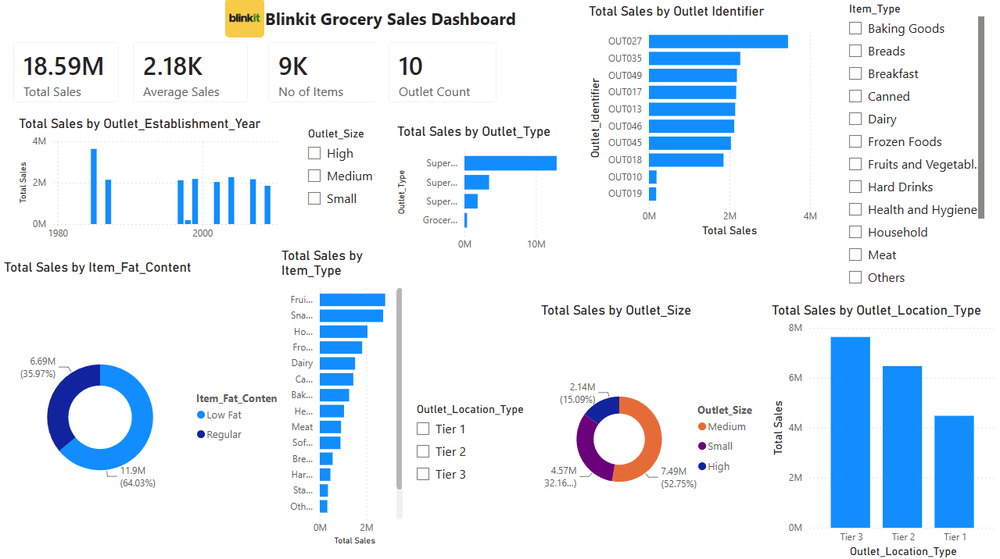

# 🛒 BlinkIT Grocery Sales Dashboard

## 📌 Project Overview

This project is an interactive Power BI dashboard developed to analyze BlinkIT grocery sales data. The dashboard provides insights into sales performance, outlet characteristics, product categories, and customer purchasing trends through interactive visualizations and KPIs.

---

## 📊 Dashboard Preview

---

## 🚀 Tools & Technologies

- Microsoft Power BI
- Power Query
- DAX (Data Analysis Expressions)
- Microsoft Excel

---

## 📈 Key Performance Indicators (KPIs)

- 💰 Total Sales: 18.59M
- 📊 Average Sales: 2.18K
- 📦 Number of Items: 9K
- 🏪 Outlet Count: 10

---

## 📊 Dashboard Features

- Sales by Outlet Establishment Year
- Sales by Outlet Type
- Sales by Outlet Size
- Sales by Outlet Location
- Sales by Item Type
- Sales by Fat Content
- Sales by Outlet Identifier
- Interactive Slicers

---

## 💡 Business Insights

- Medium-sized outlets generated the highest revenue.
- Tier 3 locations contributed the highest sales.
- Supermarket Type 1 achieved the maximum sales.
- Fruits & Vegetables and Snack Foods are among the highest-selling categories.
- Low Fat products contribute significantly to overall sales.

---

## 📂 Dataset

BlinkIT Grocery Sales Dataset (Excel)

---

## 👨‍💻 Author

**Rajat Rangra**

Aspiring Data Analyst

### Skills

- Power BI
- SQL
- Python
- Excel
- Data Visualization
- Power Query
- DAX
